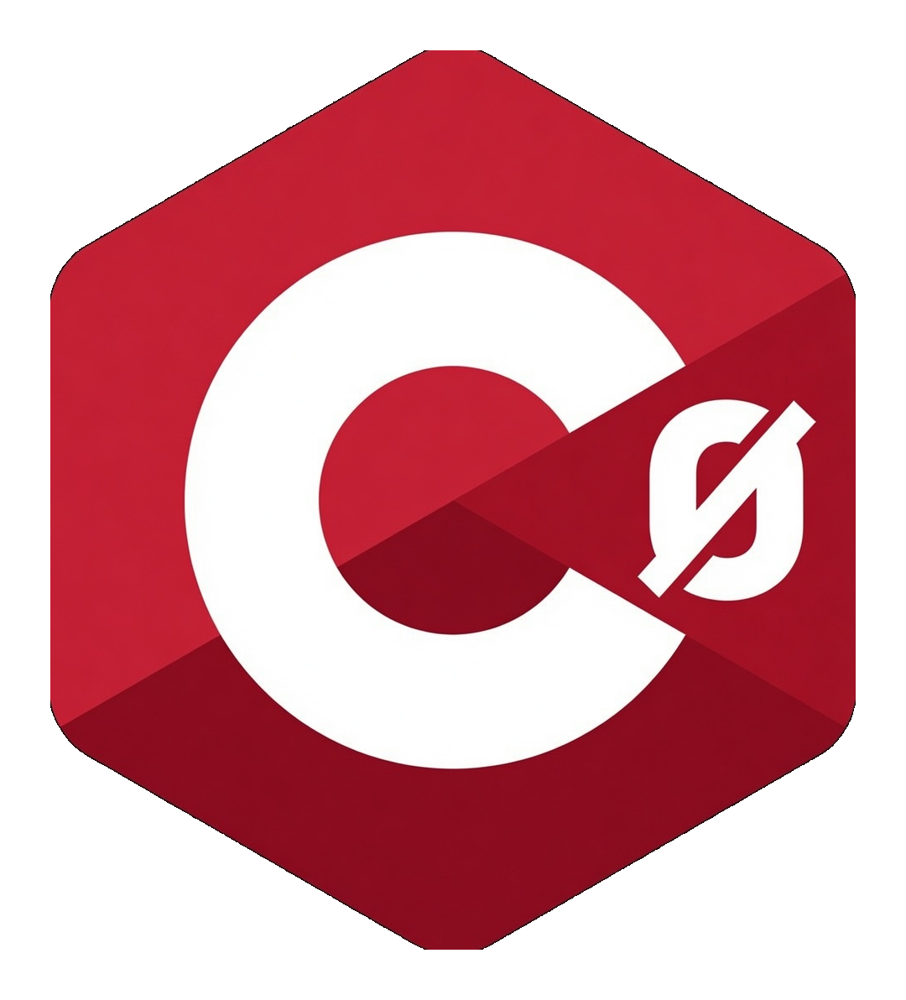

<p align="center">
  <picture>
    <source media="(prefers-color-scheme: dark)" srcset="assets/logo.png">
    
  </picture>
</p>

<h1 align="center">C0</h1>

<p align="center">
  <strong>ML elegance. Go power.</strong><br>
  A statically typed systems language that compiles to readable, idiomatic Go.
</p>

<p align="center">
  <a href="#quick-example">Example</a> •
  <a href="#why-c0">Why C0?</a> •
  <a href="#getting-started">Getting Started</a> •
  <a href="#editor-support">Editor Support</a> •
  <a href="#documentation">Docs</a>
</p>

---

C0 is a programming language for people who want OCaml/F#-level type safety and expressiveness, but need to ship Go. The compiler emits clean, human-readable Go — the kind a senior engineer would write by hand — so you get the best of both worlds without the impedance mismatch.

> **Core design constraint:** The Go emitted by the C0 compiler must be readable, idiomatic, and debuggable by any Go programmer — even one who has never seen C0.

---

## Quick example

```c0
module Main

open Std.IO

type shape =
  | Circle of { radius: float }
  | Rect of { width: float; height: float }

let area (s: shape) : float =
  match s with
  | Circle { radius } -> 3.14159 *. radius *. radius
  | Rect { width; height } -> width *. height

let main () =
  let s = Circle { radius = 2.0 } in
  Console.print_line (Float.to_string (area s))
```

This compiles to a plain Go package with interface-based sum types and type switches — readable Go that looks hand-written:

```go
func (c Circle) area() float64 {
    return 3.14159 * c.radius * c.radius
}
```

---

## Why C0?

**You know Go's runtime, tooling, and ecosystem are excellent.** You want to deploy to that world. But the language itself — the type system, the error handling, the ceremony — sometimes gets in your way.

C0 gives you:

- **Algebraic data types** — sum types (enums with payloads), records, pattern matching with exhaustiveness checking
- **Type-safe error handling** — no forgotten `if err != nil`, no panics leaking to production
- **Zero-overhead abstractions** — generics, higher-order functions, parametric polymorphism that compile down to concrete Go code
- **Seamless Go interop** — use any Go library directly, call C0 from Go and vice versa, mixed `.c0` + `.go` projects work out of the box
- **Readable output** — the emitted Go is meant for humans, not just compilers. Open your `c0 build` output in a debugger and step through familiar code

**C0 is not a transpiler.** It's a proper compiler with type inference, exhaustive pattern matching, and safety guarantees Go doesn't have — whose output just happens to be Go.

---

## Getting started

```bash
# Build the compiler
cd src && go build ./cmd/c0

# Build a C0 project (mixed .c0 + .go files welcome)
c0 build

# Start the LSP server
c0 lsp
```

Requires Go 1.21+.

---

## Project structure

```
C0/
├── docs/
│   ├── design/         # Design rationale and decisions
│   ├── spec/           # Formal grammar, semantics, lowering rules
│   └── examples/       # Example C0 programs
├── src/
│   ├── cmd/c0/         # CLI entry point (includes LSP)
│   └── internal/       # Compiler: lexer, parser, typecheck, codegen
├── syntaxes/           # TextMate grammar (VSCode, Zed, etc.)
├── editors/
│   ├── vscode/         # VSCode/Cursor extension
│   └── zed/            # Zed extension (with LSP adapter)
├── tests/              # Compiler and end-to-end tests
├── TODO.md
└── VERSION
```

## Editor support

### Zed
The Zed extension in `editors/zed/` provides:
- 🎨 Full syntax highlighting via TextMate grammar
- 🗺️ `.c0` file icons in the file tree
- ⚡ LSP integration with real-time diagnostics
- Install as a dev extension: `Zed → Extensions → Install Dev Extension → select editors/zed/`

### VSCode / Cursor
Install the extension from `editors/vscode/`:
- Syntax highlighting
- LSP client integration
- Language configuration (brackets, auto-closing pairs, comments)

### CLI
```bash
c0 lsp     # Language server (stdio)
c0 lex --color  # Terminal colorization
```

The LSP provides:
- Real-time syntax error diagnostics
- Graphical error reporting with source context, precise spans, and actionable help
- Future: hover information, completion, go-to-definition

---

## Documentation

### Design
- [Language overview](docs/design/01-overview.md)
- [Type system](docs/design/02-type-system.md)
- [Syntax](docs/design/03-syntax.md)
- [Go lowering strategy](docs/design/04-go-lowering.md)
- [Modules and packages](docs/design/05-modules-and-packages.md)
- [Effects and safety](docs/design/06-effects-and-safety.md)
- [Roadmap](docs/design/07-roadmap.md)

### Specification
- [Grammar](docs/spec/grammar.md)
- [Semantics](docs/spec/semantics.md)
- [Lowering to Go](docs/spec/lowering.md)

---

## Status

C0 is in early design and bootstrap implementation. The compiler is being written in Go and will self-host once the language is mature enough. Error reporting uses Lisette-style graphical diagnostics with source context, precise spans, and actionable help. `c0 build` supports true mixed `.c0` + `.go` projects in the same directory (including existing `go.mod` and hand-written Go files).

---

## License

MIT / Apache-2.0 dual license.
