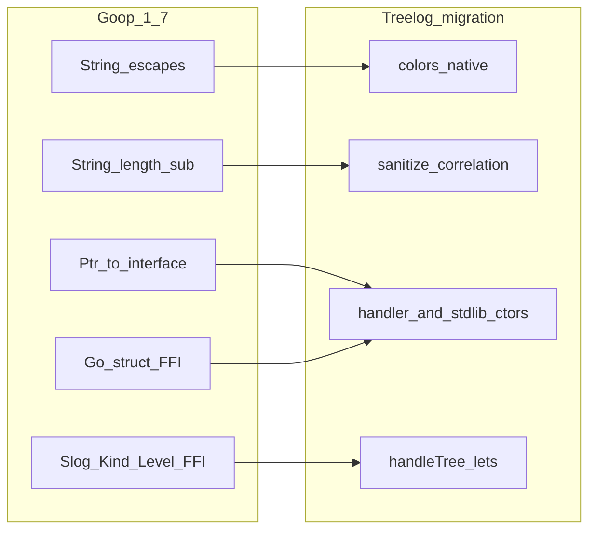

# Goop 1.7 Treelog FFI Completion

> **For agentic workers:** Use superpowers:subagent-driven-development or executing-plans. Work TDD per task. Repos: [Goop Lang](/home/redvelvet/Documents/Projects/Goop Lang) then [Goop Tree Logger](/home/redvelvet/Documents/Projects/Goop Tree Logger).

**Goal:** Ship Goop 1.7.0 string + FFI surface (including **full Go struct-literal FFI**), then rewrite Treelog so `@[go]` remains only for crypto UUID and the Go-facing `Scope.Error` alias.

**Architecture:** Language features land in Goop first (lexer → prelude → unify → gosig struct schemas → codegen → e2e). Treelog migrates second against the new compiler. Go struct FFI is a first-class phase (A5), not a deferred shim.

**Tech Stack:** Goop lexer/prelude/typecheck/codegen/gosig, `tests/*_test.goop`, Treelog `.goop` modules, slog/`sync`/`bytes` FFI via `import go`.

---

## Locked decisions

| Topic | Choice |
|-------|--------|
| Escapes | `\xHH` (exactly 2 hex digits), `\ooo` (1–3 octal), `\e` → ESC; incomplete `\x` / bad digits → LEX error; keep existing `\n\t\r\\\"` |
| String API | Prelude `String.length : string -> int` and `String.sub : string -> int -> int -> string` (Go **byte** semantics; OOB → panic like Go) |
| Heap handlers | `ptr_of { … }` on Goop records + unify **`T ptr` → Go interface** (same loose rule as value records today). No `new T {…}` keyword |
| Level compare | Native `record_level >= handler_level` on imported `Level`; delete `levelEnabled` |
| Go struct FFI | **Full implementation** (A5): gosig field schemas, typed Go struct literals, `ptr_of`, interface-typed fields, zero-value / partial literals, empty structs (`Mutex`, `Buffer`) |
| HandlerOptions | Native: `NewJSONHandler w (ptr_of { level = opts.level })` (or equivalent); **delete** `@[go] newJSONHandler` |
| Residual `@[go]` | `correlation.newID` (crypto), `Scope.Error` → `Fail` only. No Mutex/Buffer/JSON/handler ctor embeds |
| Version | Goop **1.7.0** (from current `1.6.1-dev`) |

---

## Phase A — Goop Lang (1.7.0)

### A1. String escapes (lexer)

**Files:**
- Modify: [`src/internal/lexer/lexer.go`](src/internal/lexer/lexer.go) `lexString` (+ char literals for `\x`/`\e` if cheap)
- Create: `src/internal/lexer/lexer_test.go`
- Create: `tests/string_escape_test.goop`
- Docs: [`docs/spec/grammar.md`](docs/spec/grammar.md), [`docs/design/03-syntax.md`](docs/design/03-syntax.md), [`docs/design/10-error-reference.md`](docs/design/10-error-reference.md) (LEX codes for bad hex/octal)

**Behavior:** Decode in lexer so STRING tokens hold real bytes. Edge cases: `"\x1b[31m"`, `"\033[0m"`, `"\e[0m"`, `"\x00"`, `"\377"`, truncated `"\x1"`, invalid `"\xg0"`, octal overflow policy (cap 3 digits; values > 255 → error).

**Verify:** `go test ./src/internal/lexer/…` + `goop test tests/string_escape_test.goop`

### A2. `String.length` / `String.sub`

**Files:**
- Modify: [`src/internal/prelude/prelude.go`](src/internal/prelude/prelude.go) (mirror `Array.length` lowering: `len`, custom `string_sub` → `s[i:i+n]`)
- Create: `tests/string_slice_len_test.goop`
- Docs: [`docs/stdlib/prelude.md`](docs/stdlib/prelude.md), [`docs/stdlib/builtins.md`](docs/stdlib/builtins.md)

**Edge cases:** empty string; `sub s 0 0`; `sub` at end; OOB start/len (panic like Go); multi-byte UTF-8 (length is bytes).

**Verify:** `goop test tests/string_slice_len_test.goop`

### A3. Implementor `T ptr` → Go interface

**Files:**
- Modify: [`src/internal/types/unify.go`](src/internal/types/unify.go) — in `*TPtr` case, if elem is `*TRecord` and other is interface `*TGoNamed`, succeed (parallel to lines 107–110)
- Modify: codegen return/assignment sites if interface conversion needs explicit cast (prefer Go’s implicit `*T` → interface)
- Create: `tests/go_heap_ptr_ctor_test.goop` (extend [`tests/go_implements_slog_handler_test.goop`](tests/go_implements_slog_handler_test.goop): `New (ptr_of { last = "" })` without `@[go]` ctor)
- Update examples: [`docs/examples/go_implements_slog_handler.goop`](docs/examples/go_implements_slog_handler.goop), [`docs/examples/go_method_calls.goop`](docs/examples/go_method_calls.goop) where applicable
- Docs: [`docs/design/17-go-implements.md`](docs/design/17-go-implements.md), [`docs/design/18-go-methods.md`](docs/design/18-go-methods.md), [`docs/tutorial/04-go-interop.md`](docs/tutorial/04-go-interop.md)

**Note:** Opaque Go heap types (`Mutex`, `Buffer`) are constructed in **A5**, not left as permanent `@[go]`.

### A4. slog Level compare + Value/Kind/Record fields (FFI surface, not Treelog yet)

**Files:**
- Create: `tests/go_level_compare_test.goop` — `Enabled` uses `record_level >= LevelInfo`
- Create: `tests/go_slog_record_value_test.goop` — import `Value`, `Kind`, `KindString`/`KindGroup`/…, `(v).Kind`, `(v).Group`, `(v).Resolve`, `(a).Key`/`Value`, `(r).Message`/`Level`/`Time`, `Record.Attrs` collect into `go_slice`
- Extend: [`tests/go_callback_attrs_test.goop`](tests/go_callback_attrs_test.goop), [`tests/go_implements_slog_handler_test.goop`](tests/go_implements_slog_handler_test.goop)
- Docs: [`docs/design/18-go-methods.md`](docs/design/18-go-methods.md), [`docs/design/16-treelog-feedback.md`](docs/design/16-treelog-feedback.md) (new “1.7.0” section), expand slog example Handle body

**Fix only if tests fail:** opaque Level `>=` codegen, Kind const naming via gosig, `Group()` → `Attr go_slice`.

### A5. Full Go struct FFI

This is the former “keep `newJSONHandler`” gap — implement end-to-end.

#### Design (locked)

**Import / types**
- `import go "pkg" { type Name }` remains the surface.
- On load, **gosig** classifies `Name`: interface vs struct (fix today’s bug of binding every `type` with `Interface: true` in [`bindExternTypes`](src/internal/typecheck/typecheck.go)).
- For structs, gosig returns **exported fields** + Goop-mapped types (`bool`, `string`, `TGoNamed`, `TFun`, `TPtr`, `go_slice`, …).
- Unexported fields are invisible (cannot be set; remain zero).
- Embedded structs in v1: expose **promoted exported fields** only (same as Go selector rules); no anonymous embed syntax in literals.

**Literals**
- Record literal `{ field = expr; … }` types as Go struct `S` when:
  1. **Expected type** is `S` or `S ptr` (call arg, annotated `let`, return), or
  2. Explicit ascription if the language already has a form; otherwise expected-type from context is enough for Treelog.
- Goop field names in the literal are **lowercase Goop identifiers** that map to exported Go fields via the same `exported()` convention used for Goop records (`level` → `Level`, `add_source` → `Add_source` is wrong — prefer matching Go’s exported spelling with a documented rule: map by case-fold to the unique exported field, or require the Go field name as the Goop field id when ambiguous).
  - **Locked rule:** Goop field name must match the Go exported field name **case-insensitively** and uniquely (so `level` / `Level` both bind `Level`). Ambiguous matches → type error.
- **Omitted fields** → Go zero value (partial literals allowed).
- **Empty literal** `{}` with expected type `Mutex` / `Buffer` → `sync.Mutex{}` / `bytes.Buffer{}`.
- `ptr_of { … }` with expected `S ptr` → `&S{…}` (covers `&slog.HandlerOptions{…}` and `&sync.Mutex{}`).

**Interface-typed fields (Leveler)**
- Import `type Leveler` (interface) alongside `type Level` / `type HandlerOptions`.
- When assigning field `Level : Leveler`, accept any `TGoNamed` that Go’s assignability allows for that package (minimum: `Level` → `Leveler` via gosig/`types.Assignable` check, or a hard-coded slog exception if general assignability is too large — prefer **gosig Assignable** using `go/types`).
- Function fields (`ReplaceAttr`): support Goop `fun` lowering to Go `func` when the declared field type is `TFun` / callback shape; Treelog may omit `ReplaceAttr` (zero = nil).

**Codegen**
- Emit `pkg.TypeName{Field: val, …}` with **exact Go field identifiers** from gosig (not Guessed export).
- Qualify with the Go import alias already used for that package.
- Do not emit a Goop-local struct type for imported Go structs.

**Non-goals inside A5 (still out of 1.7)**
- Auto-import of all package types without `type` decls
- Setting unexported fields
- Struct update `{ opts with level = … }` on opaque Go structs (can defer; Treelog does not need it)
- Generic Go structs

#### Files

- Modify: [`src/internal/gosig/gosig.go`](src/internal/gosig/gosig.go) — add `LookupType(importPath, typeName) (*TypeInfo, error)` with `Kind` (struct|interface|other), `Fields []Field{Name, Type string}`, and helper `Assignable(from, to)` if needed
- Modify: [`src/internal/gosig/gosig_test.go`](src/internal/gosig/gosig_test.go) — `HandlerOptions`, `Mutex`, `Buffer`, `Leveler`
- Modify: [`src/internal/types/types.go`](src/internal/types/types.go) / typecheck — store struct field schema on `TGoNamed` or parallel `goStructs` map; set `Interface` correctly
- Modify: [`src/internal/typecheck/typecheck.go`](src/internal/typecheck/typecheck.go) — `bindExternTypes`, `inferRecord` / expected-type checking for Go struct targets, field assignability
- Modify: [`src/internal/codegen/codegen.go`](src/internal/codegen/codegen.go) — `emitRecord` path when type is imported Go struct; `ptr_of` + struct literal → `&pkg.T{…}`
- Create: `tests/go_handler_options_test.goop` — `NewJSONHandler` + `ptr_of { level = LevelInfo }` (no `@[go]`)
- Create: `tests/go_go_struct_literal_test.goop` — empty `Mutex` / `Buffer` via `ptr_of {}`, partial fields, bad-field error (typecheck test), Level→Leveler field
- Extend: [`docs/examples/go_method_calls.goop`](docs/examples/go_method_calls.goop) — replace `@[go] newBuffer` with `ptr_of {}` / typed empty Buffer
- Docs: [`docs/design/18-go-methods.md`](docs/design/18-go-methods.md) (new “Go struct literals” section), [`docs/design/04-go-lowering.md`](docs/design/04-go-lowering.md), [`docs/design/17-go-implements.md`](docs/design/17-go-implements.md), [`docs/tutorial/04-go-interop.md`](docs/tutorial/04-go-interop.md), [`docs/design/16-treelog-feedback.md`](docs/design/16-treelog-feedback.md)

**Verify:** gosig unit tests + both new e2e files + updated examples under `goop check`

### A6. Goop release docs

**Files:** `VERSION` → prepare `1.7.0`, [`CHANGELOG.md`](CHANGELOG.md), [`RELEASE_NOTES.md`](RELEASE_NOTES.md), [`docs/design/07-roadmap.md`](docs/design/07-roadmap.md), [`README.md`](README.md), archive under `docs/superpowers/plans/2026-07-12-goop-1.7-treelog-ffi.md` (mirror of this plan), optional spec `docs/superpowers/specs/2026-07-12-goop-1.7-go-struct-ffi-design.md` capturing A5 decisions

**Verify:** `go test ./...` && `goop test tests/` && `goop check docs/examples/*.goop`

---

## Phase B — Treelog migration

### B1. colors — kill `@[go]`

**File:** [`colors/colors.goop`](file:///home/redvelvet/Documents/Projects/Goop%20Tree%20Logger/colors/colors.goop)

Replace ANSI helpers with native `"\x1b[…]"` / `"\033[…]"`. Keep `colorize` / `level_color`.

**Tests:** color-on assertion (`strings.Contains` ESC).

### B2. sanitize + correlation string ops

**Files:** [`sanitize/sanitize.goop`](file:///home/redvelvet/Documents/Projects/Goop%20Tree%20Logger/sanitize/sanitize.goop), [`correlation/correlation.goop`](file:///home/redvelvet/Documents/Projects/Goop%20Tree%20Logger/correlation/correlation.goop)

- `apply_partial` / `strLen` → `String.length` + `String.sub`
- `truncate_id` → same
- **Keep** `newID` `@[go]` (crypto)

**Tests:** len≤6 / 6 / 7 / long key; `TruncateID` for 0/8/9.

### B3. Handler + stdlib constructors (no construction `@[go]`)

**File:** [`treelog.goop`](file:///home/redvelvet/Documents/Projects/Goop%20Tree%20Logger/treelog.goop)

- `newTreeHandler` / `treeWithAttrs` / `treeWithGroup` / `newSanitizerHandler` → Goop `let` + `ptr_of { … }` (A3)
- `newMutex` → `ptr_of {}` with expected `Mutex ptr` (A5)
- `newBuffer` → `ptr_of {}` with expected `Buffer ptr` (A5)
- `newJSONHandler` → import `val NewJSONHandler : Writer -> HandlerOptions ptr -> Handler` and `type HandlerOptions` / `type Leveler`; call `NewJSONHandler w (ptr_of { level = level })` (A5)
- Replace trivial bridges: `slog.String`/`Int`, `io.WriteString`, `go_slice_*`, logger `.Info`/`.With`/`spread`

### B4. Move `handleTree` / `flatAttrs` / `sanitizeAttr` to `let`

Expand `import go "log/slog"` with `Value`/`Kind`/fields/methods. Rewrite collect/flat/sanitize/handle/nest/render in Goop. `flat_attrs` → `format.Attr list`.

**Residual `@[go]` only:** `correlation.newID`, `func (s *Scope) Error(...)` → `Fail`.

**Tests:** `RunSelfTests` + examples; group-attr expansion; sanitize-on-group.

### B5. Treelog docs

Update [`README.md`](file:///home/redvelvet/Documents/Projects/Goop%20Tree%20Logger/README.md) and module headers: `@[go]` = crypto + Go `Error` alias only.

**Verify:** `goop test examples/` and `go build ./...` in Treelog against Goop 1.7.

---

## Testing matrix (extensive)

| Area | Unit | E2E | Edge cases |
|------|------|-----|------------|
| Escapes | `lexer_test.go` | `string_escape_test.goop` | hex/octal/`\e`, invalid, ESC+ANSI |
| String ops | — | `string_slice_len_test.goop` | empty, UTF-8 bytes, OOB |
| Ptr→iface | — | `go_heap_ptr_ctor_test.goop` | WithAttrs + new `ptr_of` |
| Level | — | `go_level_compare_test.goop` | Info vs Debug gating |
| Value/Kind | — | `go_slog_record_value_test.goop` | Group nest, Resolve |
| Go structs | `gosig` LookupType | `go_handler_options_test.goop`, `go_go_struct_literal_test.goop` | empty Mutex/Buffer, partial HandlerOptions, Level→Leveler, unknown field error |
| Treelog | — | `RunSelfTests` + examples | color ESC, mask bounds, TruncateID, JSON path without `@[go]` ctor, grouped attrs |

---

## Out of scope (document explicitly)

- Auto-import of all Go package exports without `type`/`val` decls
- Setting unexported Go struct fields
- `{ goStruct with field = … }` updates on opaque Go structs
- Generic Go structs
- Replacing `correlation.newID` crypto embed
- `defer` keyword
